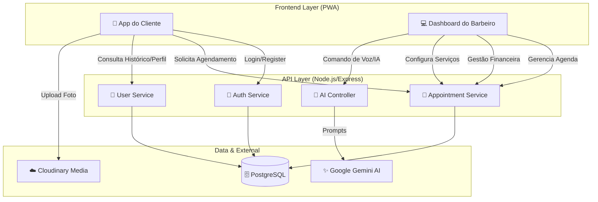

# 📘 Documentação Técnica - Trilha do Corte (SaaS Barber)

**Data:** 03 de Janeiro de 2026
**Versão:** 1.0
**Projeto:** Plataforma de Gestão para Barbearias com Estética Cyberpunk

---

## 1. Visão Geral do Sistema

O **Trilha do Corte** é uma plataforma SaaS "High-Tech" projetada para modernizar a gestão de barbearias. O sistema conecta clientes e barbeiros através de uma interface visualmente impactante (Cyberpunk/Dark Mode), priorizando a experiência do usuário (UX) e automação inteligente.

### Diferenciais Técnicos

- **Estética Imersiva:** Design System próprio focado em Neon/Dark Mode e Glassmorphism.
- **Inteligência Artificial:** Integração nativa com **Google Gemini** para comandos de voz e assistente de estilo.
- **PWA (Progressive Web App):** Aplicação otimizada para dispositivos móveis com performance nativa.

---

## 2. Stack Tecnológica

### Frontend (Client & Dashboard)

- **Framework:** React 19 + Vite (Build ultra-rápido).
- **Linguagem:** TypeScript (Tipagem estrita para segurança de código).
- **Estilização:** Tailwind CSS (Utility-first) + Animações CSS Keyframes.
- **Gráficos e Ícones:** Lucide React (Ícones de interface) + Phosphor Icons (Seles e badges).
- **Gerenciamento de Estado:** React Context API + LocalStorage (Persistência leve).

### Backend (API Server)

- **Runtime:** Node.js.
- **Framework Web:** Express.js (REST API).
- **Autenticação:** JWT (Json Web Token) + Bcrypt (Hashing de senhas).
- **Integração IA:** Google Generative AI SDK (`gemini-2.5-flash`).

### Banco de Dados & Armazenamento

- **Database:** PostgreSQL (Relacional - Clientes, Agendamentos, Serviços, Barbeiros).
- **Media Storage:** Cloudinary (Otimização e hospedagem de imagens de perfil/serviços).

---

## 3. Arquitetura e Fluxograma do Sistema

### Diagrama de Fluxo de Dados (Mermaid)

---

## 4. Detalhamento dos Módulos

### 📱 A. Módulo do Cliente (Customer App)

Focado na retenção e facilidade de agendamento.

1.  **Home & Agendamento:**
    - Visualização de serviços e combos ("Combos" têm destaque visual de selos).
    - Seleção de Data e Horário disponível.
    - Confirmação com resumo do serviço.
2.  **Perfil & Loyalty (Trilha Card):**
    - Cartão de fidelidade digital (Gamification).
    - Histórico de cortes com fotos ("Visual Memories").
    - Consulta IA: Sugestões de cortes baseados no formato de rosto (via Gemini).

### 💈 B. Módulo do Barbeiro (Dashboard Admin)

Ferramenta de gestão completa.

1.  **Dahsboard Home:**
    - Visão geral do dia (Fila de atendimento).
    - Indicadores financeiros rápidos.
    - Controle de "Aberto/Fechado".
2.  **Agenda (CalendarView):**
    - Visualização diária/semanal.
    - Bloqueio de horários.
    - Status de agendamento (Pendente, Confirmado, Concluído).
3.  **Gestão de Clientes:**
    - CRM simples: Lista de clientes, frequência e notas.
    - Invite Flow: Geração de links para cadastro rápido via WhatsApp.
4.  **Financeiro (Vault):**
    - Relatórios de faturamento.
    - Ticket médio e métricas de desempenho.
5.  **Configurações:**
    - Gestão de Serviços (Preço, Duração, Badges).
    - Horário de funcionamento do estabelecimento.

---

---

## 5. Fluxos Críticos de Negócio

### 1. Fluxo de Agendamento (Guest & Auth)

1.  **Cliente:** Seleciona Serviço > Escolhe Data/Hora (Landing Page ou App).
2.  **Frontend:** Envia `POST /appointments` (Público).
3.  **Backend (Segurança):**
    - Verifica token (opcional, associa `clientId` se houver).
    - Tenta `INSERT` no DB.
    - **Proteção Anti-Conflito:** Índice Único (`date` + `time`) impede colisão. Se houver, retorna `409 Conflict`.
4.  **Resultado:** Sucesso ou Erro amigável ("Horário acabou de ser reservado").

### 2. Fluxo de Comando de Voz (IA - Protegido)

1.  **Barbeiro (Logado):** Clica no microfone e fala comando.
2.  **Frontend:** Envia para `/api/ai/command` com Token JWT.
3.  **Backend:** Valida Token > Envia prompt para o **Gemini**.
4.  **Hardware/Ação:** Executa bloqueio ou consulta.

---

## 6. Estrutura de Banco de Dados (Principais Entidades)

- **Users (Clients/Barbers):** `id`, `name`, `email`, `phone`, `password`, `role`.
- **Services:** `id`, `name`, `price`, `duration`, `category`.
- **Appointments:** `id`, `client_id`, `barber_id`, `service_id`, `date`, `status`.

---

## 7. Próximos Passos (Roadmap Técnico)

- Refinamento da IA para "Conversational Booking".
- Implementação de WebSockets para atualizações da agenda em tempo real (substituindo polling).
- Expansão do sistema de Loyalty (Prêmios automatizados).
